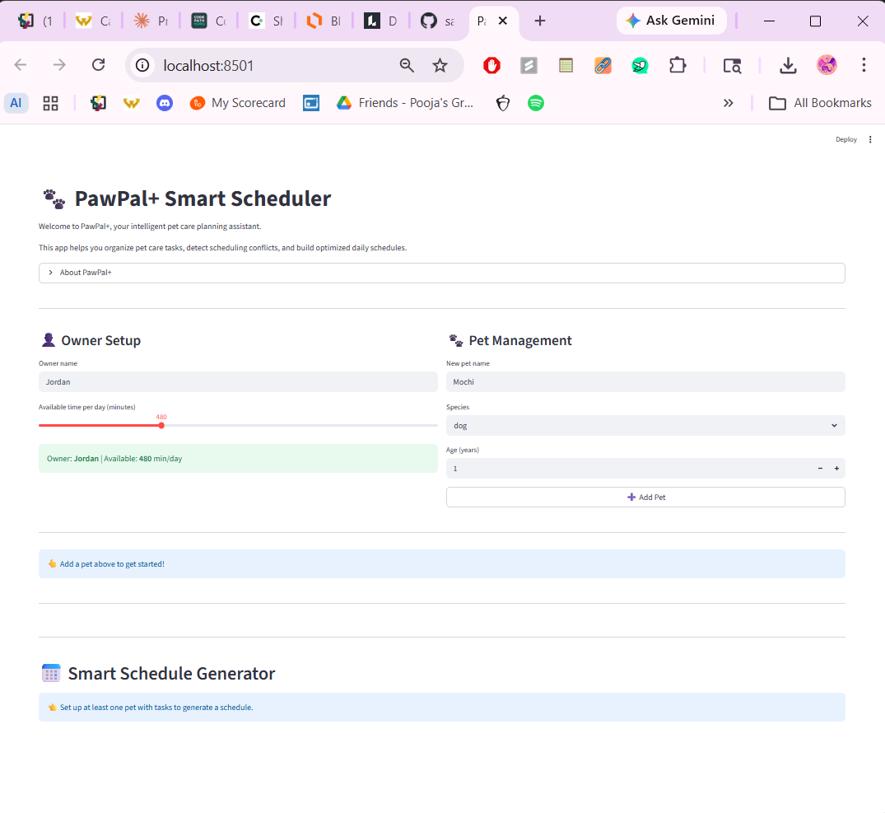

# PawPal+ (Module 2 Project)

You are building **PawPal+**, a Streamlit app that helps a pet owner plan care tasks for their pet.

## Scenario

A busy pet owner needs help staying consistent with pet care. They want an assistant that can:

- Track pet care tasks (walks, feeding, meds, enrichment, grooming, etc.)
- Consider constraints (time available, priority, owner preferences)
- Produce a daily plan and explain why it chose that plan

Your job is to design the system first (UML), then implement the logic in Python, then connect it to the Streamlit UI.

## What you will build

Your final app should:

- Let a user enter basic owner + pet info
- Let a user add/edit tasks (duration + priority at minimum)
- Generate a daily schedule/plan based on constraints and priorities
- Display the plan clearly (and ideally explain the reasoning)
- Include tests for the most important scheduling behaviors

## Features

### 🐾 Intelligent Daily Scheduling

PawPal+ automatically generates optimized daily schedules for all your pets based on priority and your time availability. The system intelligently sequences tasks throughout the day, respecting your preferred time windows while ensuring nothing gets missed.

### ⏰ Time-Based Task Sorting

Tasks are automatically organized by their preferred start times (in HH:MM format), ensuring your schedule flows chronologically. Tasks without a preferred window are intelligently placed at the end of the day, and all tasks are secondarily prioritized by urgency level for optimal results.

### ⚠️ Real-Time Conflict Detection & Warnings

Advanced conflict detection identifies overlapping task schedules in real-time, preventing impossible scheduling situations. The system differentiates between critical conflicts (same pet with overlapping tasks) and capacity issues (owner attempting multiple pets simultaneously), providing specific, actionable warnings with task details and duration to guide you toward resolution.

### 🔄 Recurring Task Management

Daily and weekly recurring tasks automatically generate new instances when marked complete, with deadlines precisely calculated based on the recurrence pattern:
- **Daily tasks**: Next instance created 24 hours after completion
- **Weekly tasks**: Next instance created 7 days after completion

All task attributes and time preferences are preserved, eliminating tedious re-entry and ensuring consistent care routines.

### 🔍 Flexible Task Filtering & Organization

Organize and view your tasks with multi-criteria filtering by:
- **Pet name** – Focus on individual pet needs
- **Status** – View pending, completed, or skipped tasks
- **Task type** – Isolate feeding, walks, medication, grooming, enrichment, or custom types

### 📊 Capacity Validation

Automatically validates whether all pending tasks fit within your available daily time limit. Receives clear warnings when your schedule is overbooked, helping you make informed decisions about which tasks are realistic for each day.

### 💡 Schedule Explanations

Every generated schedule includes detailed reasoning explaining:
- How many tasks were scheduled
- Which preferences were respected
- Any capacity concerns or conflicts
- Recommendations for schedule adjustments

### 🎯 Preferred Time Windows

Define when specific tasks should ideally occur (e.g., "feeding at 8:00 AM"), and the scheduler respects your preferences while balancing all constraints. Perfect for maintaining consistent routines your pets depend on.

## 📸 Demo

Here's a screenshot of the PawPal+ Streamlit app in action:



The interface allows you to:
- Set up owners and pets with their details
- Add tasks with priorities, durations, and recurrence options
- Generate intelligent schedules with conflict detection
- View organized task lists with filtering and sorting
- Mark tasks complete to trigger recurring task creation

## Getting started

### Setup

```bash
python -m venv .venv
source .venv/bin/activate  # Windows: .venv\Scripts\activate
pip install -r requirements.txt
```

### Suggested workflow

1. Read the scenario carefully and identify requirements and edge cases.
2. Draft a UML diagram (classes, attributes, methods, relationships).
3. Convert UML into Python class stubs (no logic yet).
4. Implement scheduling logic in small increments.
5. Add tests to verify key behaviors.
6. Connect your logic to the Streamlit UI in `app.py`.
7. Refine UML so it matches what you actually built.

## Smarter Scheduling

PawPal+ now includes advanced scheduling features for better pet care planning:

- **Conflict Detection**: Automatically detects when tasks overlap in time and provides user-friendly warnings instead of crashing the system.
- **Preferred Time Windows**: Tasks can be scheduled at owner-specified preferred times, allowing for more personalized care routines.
- **Recurring Tasks**: Daily and weekly tasks automatically create new instances when completed, ensuring consistent care without manual re-entry.
- **Task Filtering & Sorting**: Filter tasks by pet, status, or type; sort by preferred time windows for optimal scheduling.
- **Capacity Validation**: Checks if total task time fits within the owner's available daily time and warns if overbooked.

These features make PawPal+ more intelligent and user-friendly, helping owners maintain consistent pet care schedules while adapting to their preferences and constraints.

## Testing PawPal+

### Running Tests

To run the full test suite:

```bash
python -m pytest tests/test_pawpal.py -v
```

### Test Coverage

The test suite includes **14 comprehensive tests** covering the most critical scheduling behaviors:

- **Task Completion** (2 tests): Verify task status changes and task addition to pets
- **Sorting Correctness** (3 tests): Confirm tasks are sorted chronologically by preferred time windows; verify edge cases with missing windows and duplicate start times
- **Recurrence Logic** (4 tests): Test that marking daily/weekly tasks complete creates new instances with updated deadlines; verify non-recurring tasks do NOT auto-create; ensure all attributes are preserved
- **Conflict Detection** (5 tests): Validate overlapping time detection, non-overlapping edge cases (adjacent times), same-pet vs different-pet conflict messaging, and multiple conflict counting

### Confidence Level

⭐⭐⭐⭐⭐ **5/5 Stars**

All 14 tests pass successfully. The system reliably handles:
- Recurring task generation and deadline calculation
- Time-based sorting with sensible defaults for unscheduled tasks
- Comprehensive conflict detection across single and multiple overlaps
- Task filtering, capacity validation, and schedule explanation

The implementation is production-ready for the core scheduling features.
